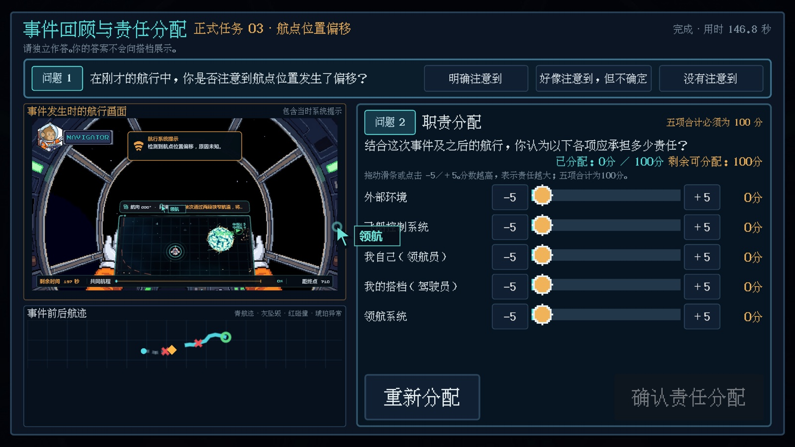

# DeepNav

<p align="center">
  
</p>

两人、两块屏、两只鼠标。领航员看星图并投放航点，驾驶员坐在驾驶舱里执行机动。同一艘飞船，同一段时限，必须靠沟通把船送到目的地。

标题页打开 **实验模式** 后，同一套流程会按会话写原始日志，方便现场采集。

| 领航员屏 | 驾驶员屏 |
| :---: | :---: |
|  |  |
| 看窗外三维与星图，点击投放航点 | 看驾驶舱与仪表，按 `W A S D` 执行机动 |

## 玩法

| 席位 | 看什么 | 做什么 |
| --- | --- | --- |
| **领航员** | 大范围三维窗外，底下叠一块星图 | 在星图上点击放置航点，规划绕行与恢复 |
| **驾驶员** | 船内第一人称驾驶舱 | `W A S D` 推进、刹车、转向，跟随航点飞行 |

启动后两只物理鼠标分别控制席位 A / 席位 B 的虚拟光标。键盘固定为 **Mac 内置键盘 = 席位 A、外接键盘 = 席位 B**。岗位由任务开始前的认领决定，键盘职责随岗位变化：驾驶员键盘使用 WASD，领航员键盘使用 E。

| 操作 | 作用 |
| --- | --- |
| 星图左键 | 放置航点（正式实验冷却 4 秒，最大距离 72 世界单位） |
| 驾驶员所在席位的 `W A S D` | 推进 / 刹车 / 转向 |
| 领航员所在席位的 `E` | 升起或降下星图 |
| `R` | 重置当前飞行 |
| `F4` | 交换两块屏上的岗位画面 |
| `F6` | 只校正鼠标与屏幕对应关系，不交换键盘 |

航点不能丢到边界排斥区外。目标异常发生前解体时，训练关回起点，正式关回到最近一座已抵达的**中继站**；目标异常发生后解体则自然结束当前航段，先展示失败结果，再进入事件评价。时限耗尽也会判负。

## 流程

`标题` → `选关` → `认领岗位` → `飞行` → `自然结算` → 下一关。训练关增加操作理解检查；正式任务 03、04 在目标异常后的行为窗口完整结束后，才进入事件回顾、责任分配和状态评价。最后一关双方提交后进入 `感谢游玩`。

<p align="center">
  
</p>

进度只存在本次运行的内存里。从标题页重新开始，或退出后再进，都会从训练关归零。关卡完成后按顺序解锁；需要事件评价的关卡由双方各自提交后进入下一关。

<p align="center">
  
</p>

认领必须分清是屏幕 A 还是屏幕 B 点的。同一岗位不能被两边同时占住；点关闭可以退回重选。两边都认领后才能出发。

## 五关

每关只练一件协作问题。训练关短、开阔、不设中继站；后面四关按阶段横向展开，16:9 只是一次可见范围，不是整张地图。左边是关卡概念图，右边是玩家实际看到的全图星图。

| 关卡 | 概念图 | 实际星图 |
| :---: | :---: | :---: |
| **00 训练航道**<br>建立分工：短航点、冷却、跟随 |  |  |
| **01 织环航道**<br>开阔进场后依次绕过三处环形尘带 |  |  |
| **02 折光走廊**<br>连续通过四道错位航门，减速再转向 |  |  |
| **03 寂井侧翼**<br>依次通过两段狭窄航道 |  |  |
| **04 潮汐远航**<br>沿连续弯道分段规划并及时减速 |  |  |

关卡设计理由、边界规则和小行星带不可直穿的检查见 [关卡设计](docs/mission_design.md)。审核路线只画在 `artifacts/maps/` 的开发图里，实验界面不会展示。

## 结算与量表

目标异常发生时不中断航行。系统继续记录应对与恢复行为，直到抵达安全点，或航段因成功、解体、超时而自然结束。随后先展示带事故画面的结果回顾，再由两名参与者独立完成异常觉察、100 分责任分配、判断信心与简短状态评价。回顾只陈述可观察事实，不用引导性语言重复异常成因。

量表的构念、角色分流、成功/失败处理和新旧字段见 [关末量表重构说明](docs/questionnaire_redesign.md)。

| 成功 | 失败 |
| :---: | :---: |
|  |  |

| 事件回顾与责任分配 | 状态评价 |
| :---: | :---: |
|  |  |

最后一关（正式任务 04）双方都提交后，进入感谢页。可以从这里返回标题，或直接退出。

<p align="center">
  
</p>

## 实验数据

标题页打开 **实验模式** 再点开始，先输入数字组号，再建立只追加、不覆盖的 session。每组开始时按 1:1 随机分配明确成因提示或模糊原因提示，组号只作为稳定样本编号，不决定实验条件；A/B 屏幕侧每四组翻转一次，避免条件和固定屏幕混淆。调试模式不会混入正式样本。

数据写在游戏可写目录：

`user://experiments/dyad-D<组号>/<UTC时间>/raw/`

macOS 上大致对应：

- 编辑器运行：`~/Library/Application Support/Godot/app_userdata/DeepNav/experiments/`
- 导出的 `.app`：`~/Library/Application Support/DeepNav/experiments/`

`raw/` 里有：

- `sessions.csv`：会话、组号、随机条件和屏幕平衡信息
- `missions.csv`：每次航段的开始、结果和任务汇总
- `target_events.csv`：唯一核心异常、触发位置、实际生效和恢复窗口
- `ratings.csv`：与 `event_id` 连接的异常觉察、责任分配和状态评价
- `waypoints.csv`：每次航点请求、冷却、接受结果和修正记录
- `events.csv`：碰撞、中继站、系统提示、任务结束等离散事件
- `frames.csv`：每个物理帧的双方席位、光标、按键、驾驶输入和飞船状态
- `quality_report.json`：会话结束时生成的数据完整性检查

CSV 磁盘写入不在游戏主循环中执行。详细分组规则、字段和现场检查见 [实验数据说明](docs/experiment_data.md)。

标题页的 **打开数据文件夹** 会先创建 `user://experiments/`，再用系统文件管理器打开，行为和 [Dyadic Force](https://github.com/Zhaohan-Wang/dyadic-force) 一致。

## 运行

- 引擎：**Godot 4.6**（Forward Plus + Jolt）
- 主场景：`scenes/title_screen.tscn`
- 双屏必须用独立进程，不要用编辑器里的「嵌入游戏」播放

```bash
# 把 GODOT_BIN 指到 Godot.app 里的可执行文件
export GODOT_BIN="/Applications/Godot_mono.app/Contents/MacOS/Godot"

tools/run.sh
```

现场两块扩展屏、两只外接鼠标时，macOS 会通过 `native/macos` 的 HID 桥按物理设备分流原始输入。需要重编桥接进程时：

```bash
tools/build_macos_hid_bridge.sh
```

制作包含双鼠标桥和应用图标的独立 macOS 包：

```bash
tools/package_macos.sh
```

默认输出到相邻的 `deep-nav-dist/`，其中包含 `DeepNav.app`、可分享的 `DeepNav-macOS.zip` 和实验数据位置说明。

## 校验

日常修改先跑关键回归；改地图时追加地图专项；正式打包前再跑完整回归。图形性能实测独立运行，单次启动会依次测完五关，并在异常卡顿时自动超时退出。

```bash
tools/validate_project.sh
tools/validate_project.sh --maps
tools/validate_project.sh --full
tools/validate_performance.sh
```

成功标志：

```text
DEEP_NAV_VALIDATION_OK
PERFORMANCE_VALIDATION_OK
```

GitHub 展示图必须使用当前版本的真实运行截图，不能继续沿用旧版领航员、驾驶员或关卡画面。完成界面或地图调整并生成 `artifacts/runtime/` 与 `artifacts/star_map_overviews/` 后，运行 `tools/update_readme_images.sh`，再逐张检查裁切和文字清晰度后提交。

## 架构

- Autoload：`Game` / `GameAudio` / `ExperimentLog` / `RawMice` / `Displays`
- 关卡目录：`scripts/mission_catalog.gd`
- 双屏与虚拟光标：`scripts/display_coordinator.gd`
- 实验写盘：`scripts/experiment_log.gd`

共用页按 1920×1080 设计；进入岗位页后切到 960×540，再放大铺满整块屏，和早期并排双视图的排版一致。
